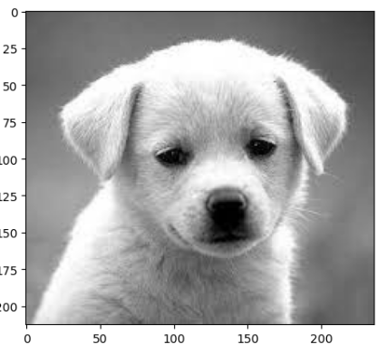
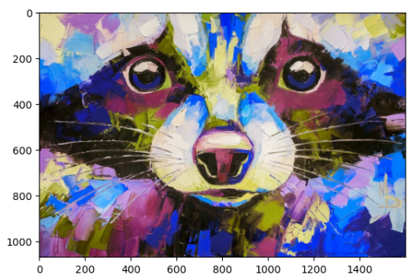
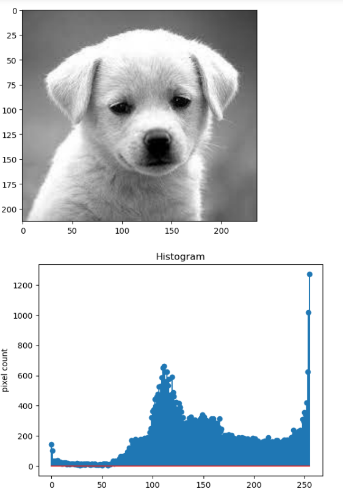
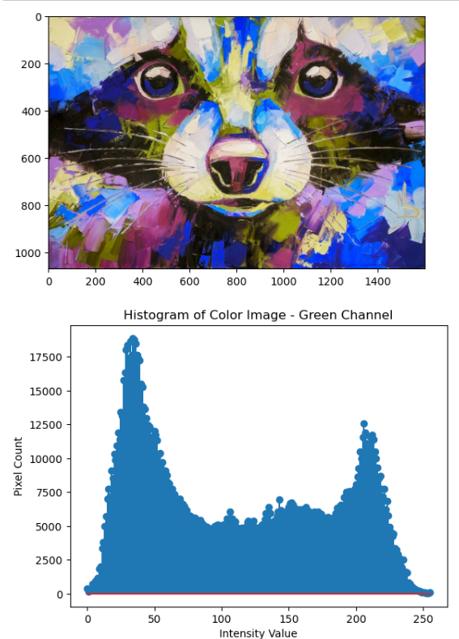
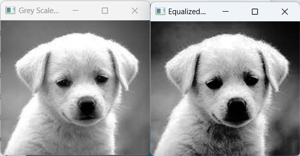

# Histogram-of-an-images
## Aim
To obtain a histogram for finding the frequency of pixels in an Image with pixel values ranging from 0 to 255. Also write the code using OpenCV to perform histogram equalization.

## Software Required:
Anaconda - Python 3.7

## Algorithm:
### Step1:
Read the gray and color image using imread()

### Step2:
Print the image using imshow().

### Step3:
Use calcHist() function to mark the image in graph frequency for gray and color image.

### step4:
Use calcHist() function to mark the image in graph frequency for gray and color image.

### Step5:
The Histogram of gray scale image and color image is shown.


## Program:

# Developed By: Sowmiya N
# Register Number: 212221230016
```
import numpy as np
import cv2
Gray_image = cv2.imread("gimg.png")
Color_image = cv2.imread("cimg.png")
plt.imshow(Gray_image)
plt.show()
plt.imshow(Color_image)
plt.show()

plt.imshow(Gray_image)
plt.show()
hist =cv2.calcHist([Gray_image], [0], None, [256],[0,256])
plt.figure()
plt.title("Histogram")
plt.xlabel('grayscale value')
plt.ylabel('pixel count')
plt.stem (hist)
plt.show()

plt.imshow(Color_image)
plt.show()
hist1=cv2.calcHist([Color_image], [1], None, [256], [0,256])
plt.figure()
plt.title("Histogram of Color Image - Green Channel")
plt.xlabel("Intensity Value")
plt.ylabel("Pixel Count")
plt.stem (hist1)
plt.show()

import cv2
gray_image = cv2.imread("gimg.png",0)
cv2.imshow('Grey Scale Image',gray_image)
equ = cv2.equalizeHist(gray_image)
cv2.imshow("Equalized Image",equ)
cv2.waitKey(0)
cv2.destroyAllWindows()
```
## Output:
### Input Grayscale Image and Color Image


### Histogram of Grayscale Image and any channel of Color Image



### Histogram Equalization of Grayscale Image.


## Result: 
Thus the histogram for finding the frequency of pixels in an image with pixel values ranging from 0 to 255 is obtained. Also,histogram equalization is done for the gray scale image using OpenCV.
